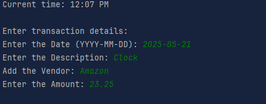

# About Accounting Program Capstone 1 🧮
In this project, I built a Java CLI application to track financial transactions for either business or personal use.
It will store all transactions in a file named transactions.csv, with each transaction saved as a single line in the file. 
It will ensure that each line includes important details such as the date, time, description, vendor, and amount. 
This application will read from and write to the transaction file to help users manage financial data efficiently.

# Roadmap 🚧
1. I looked through the documentation and Created the classes that I needed for my program to work:
* A Transaction Class contains a constructor, Setters and Getters and a overwrite method to save date, time, description, vendor, and amount.
* An Exit Handler to handel when the user is done with the program using the Scanner and to accomplish this.
* This class is responsible for handling all file and time-related operations for the ledger system. It performs the following functions:

Read from File: Reads and displays transaction data from the transactions.csv file directly to the terminal.

Write to File: Writes new transaction entries (deposits or payments) to the transactions.csv file.

Timestamp Entries: Automatically captures the current date and time when a new transaction is entered and includes it in the file.

* The Ledger class manages and displays financial transactions from a CSV file. It provides a home menu interface for viewing deposits, payments, and vendor-based reports. It reads transaction data from transactions.csv on initialization and filters entries based on user input.
* Finally, a Main class that contains that displays Entering a date, description, vendor, amount, greetings and a closing text when the code is done running.

# Screenshots 📸

This is that 1st thing you see when you run this app it displays the current time, asks you for the date (YYYY-MM-DD), 
Enter the Description (What is the item user purchased), Add the Vendor, and lastly Enter the Amount. Once the transaction is complete the message Transaction Added! will appear.

You could also add another transaction if you wanted to by pressing Y or y to ann another when Do you want to add another transaction? (y/n) shows up and then when you're done you could exit the app early by pressing Do you want to exit the app? (y/n)

Once you press N or n you will see the list of items previously in the ledger and the newer additions as well

After that you will see the home screen to show your options:

As shone here you can press D or d to get deposits:

Pressing p or P to get payments:

Using r or R you can pull up specific transactions:

Using h or H to make sure your on the home screen:

Finally, e or E to x or X to exit app:

