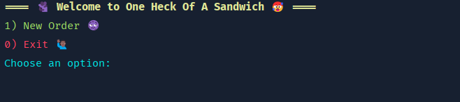

# About One Heck of-a Sandwich Shop 😈🥪
This project is developing a point of sale (POS) application for One Heck of a Sandwich Shop, a custom sandwich shop, to streamline and automate the ordering process. 
It will leverage object-oriented programming principles by organizing the system into well-structured classes and interfaces that represent sandwiches, sides, orders, and more. 
The development starts with a class flowchart to guide the architecture, which will be updated and maintained in the project repository as the application evolves.

# Roadmap 🚧🥪
1. I started by thoroughly reviewing the project documentation to determine which classes would be needed for the application.
2. Then, I created a flowchart using Draw.io to visualize how the system components interact. 
Although the diagram appears a bit chaotic, I used color-coded arrows to clearly indicate which classes and code belong to each package, helping me understand how everything works together.
3. First, I created a package named Heck_Emuns, which stores all the constant variables needed throughout the project. This package is divided into three classes.
* BreadType, which contains the following constants: WHITE, WHEAT, RYE, and WRAP. These represent the different types of bread available for customers at the sandwich shop.
* DrinkSize, which contains the following constants: SMALL, MEDIUM, LARGE. These represent the different types of drink sizes available for customers at the sandwich shop.  
* SandwichSize, which contains the following constants: FOUR_INCH, EIGHT_INCH, TWELVE_INCH. These represent the different lengths of sandwiches available for customers at the sandwich shop.
4. I created a package named Sides, this package contains two classes:
* Chips which represents a chips side item in the sandwich shop, storing the chip type as a string. It provides methods to return a fixed price of $1.50 and a description of the chips including their type and price.
* Drink  class models a drink item with a specific size and flavor using the DrinkSize enum. It includes methods to determine the price based on size and to return a formatted description of the drink with its size, flavor, and price.
5. Created my Heck_Toppings package with contains the following classes:
* Heckful_Toppings class is an abstract base class representing a sandwich topping, including its name and whether it’s an extra portion. It defines an abstract method getPrice(SandwichSize size) that must be implemented by subclasses to calculate the topping's price based on sandwich size.
* Heckful_RegularToppings class extends the abstract Heckful_Toppings class and represents standard toppings that are included at no extra cost. Its getPrice method always returns 0.0, regardless of the sandwich size, indicating that these toppings are free.
* Heckful_PremiumToppings class extends Heckful_Toppings and represents premium sandwich toppings like meats and cheeses. It calculates the topping's price based on the sandwich size and whether the topping is an extra portion, with meats and cheeses having different base and extra costs.
6. Created the Heck_Signatures package which contains:
* Hecks_Signature class extends Heckful_Sandwich and represents a predefined signature sandwich with a specific name, size, bread type, and toasted preference. It adds a name field to identify the signature sandwich and provides a getter method for it.
* BLT_O_Heck class is a specific signature sandwich that extends Hecks_Signature, preconfigured with the name "BLT", an 8-inch toasted white bread base, and a set of predefined premium toppings. It adds bacon, cheddar, lettuce, tomatoes, and ranch as its ingredients using the addTopping method.
* The Heck_O_Alot_Of_PhillyCheeseSteak class defines a signature sandwich by extending Hecks_Signature, preset with the name "Philly Cheese Steak", 8-inch toasted white bread, and a specific combination of toppings. It includes steak, American cheese, peppers, and mayo using the addTopping method to build the sandwich.
7. Created a package named One_Heck_of_a_Sandwich_Package which contains:
* Heckful_Sandwich class represents a customizable sandwich, including its size, bread type, toasted option, and a list of toppings. It provides methods to add toppings, calculate base and total prices (including topping costs), and generate a formatted description of the complete sandwich order.
8. Created the package named Heckful_Order which contains:
* Heck_Order class which represents a sandwich shop order that can contain multiple sandwiches, drinks, and chips, with each item stored in separate ArrayLists and automatically timestamped when created. The class provides methods to add items, calculate the total price across all items, and generate a formatted receipt showing all order details and the final cost.
9. Created a package named Your_Soulful_Receipts witch contains:
* ReceiptWriter this class  provides a static method to save order receipts as text files to disk. It creates a "receipts" directory if it doesn't exist, then writes the receipt content to a timestamped filename using the current date and time, with basic error handling for file I/O operations.
10. Next package I created is named UI_OF_THE_DANGED which contains:
* One_Heck_Of_A_UI which provides a colorful command-line user interface for a sandwich ordering system, featuring a main menu loop and order management with options to add sandwiches, drinks, and chips to an order. The interface uses extensive color coding and emojis throughout the user experience, guiding customers through sandwich customization (size, bread, toppings), drink selection, chip choices, and final checkout with receipt generation and file saving.
* CaseColors which provide the color for the case codes and ColorCodes which provies the color for the terminal when you are running/building my application.
11. Finally, my Main class which is named One_Heck_Of_A_Main which run the UI from One_Heck_Of_A_UI.

# FlowChart 📊🥪

This is the flowchart I created to make sure that I do not get lost making this project. I also have a previous version here to compare between the two: https://github.com/Year-Up-United-SPR-2025/Capstones/blob/main/One_Heck_Of_A_Sandwich_Cap_2/UML's/OldFlowChart/One%20Heck%20of%20a%20Board.jpg

# Screenshots 📹
'

This is my homescreen which contains a greeting and two options and entry line for you to type in one of two options. 

 

As you press 1 you see a quick message of Starting new order... and the see the Order Menu which uses five numbers 0-4 (not in that order but ok):
1) Add Sandwich 🥪
2) Add Drink 🍹
3) Add Chips
4) Checkout ✅
0) Cancel Order 🪦

# References 🧭
https://github.com/Year-Up-United-SPR-2025/Capstones/blob/main/One_Heck_Of_A_Sandwich_Cap_2/resources/resorces.txt

This project wouldn't have been possible without the help of these references.